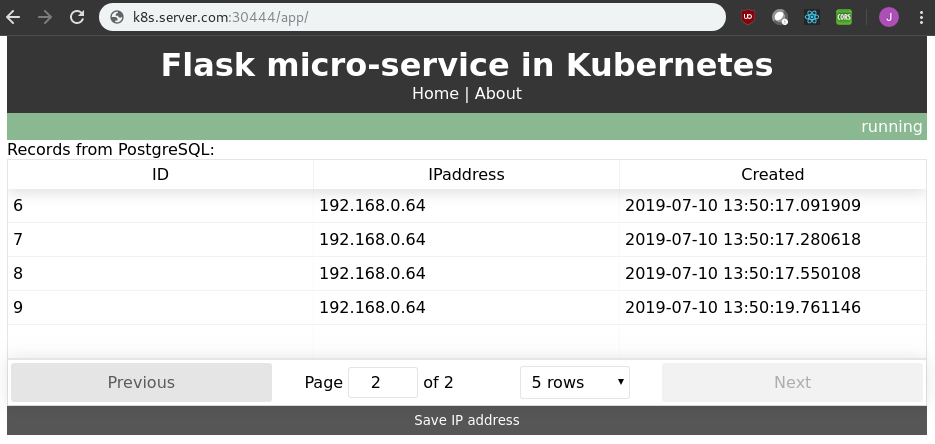
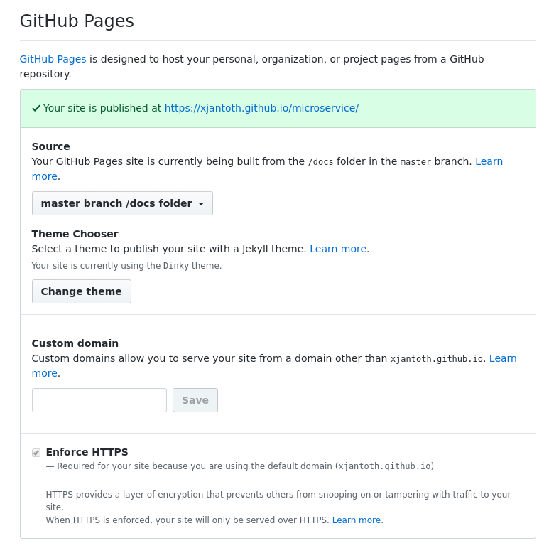

# Table of contents
- [Table of contents](#table-of-contents)
  - [Run PostgreSQL database locally as docker container <a name="database"></a>](#run-postgresql-database-locally-as-docker-container-a-name%22database%22a)
  - [Getting started with a helm chart deployment <a name="dummy-helm-chart-deployment"></a>](#getting-started-with-a-helm-chart-deployment-a-name%22dummy-helm-chart-deployment%22a)
  - [Backend - Python Flask <a name="backend"></a>](#backend---python-flask-a-name%22backend%22a)
      - [Overview of backend env. variables <a name="env-variables"></a>](#overview-of-backend-env-variables-a-name%22env-variables%22a)
      - [Run backend locally <a name="run-backend-locally"></a>](#run-backend-locally-a-name%22run-backend-locally%22a)
      - [Run backend as docker container locally <a name="run-backend-as-docker-container-locally"></a>](#run-backend-as-docker-container-locally-a-name%22run-backend-as-docker-container-locally%22a)
      - [Backend helm chart deployment <a name="backend-helm-chart-deployment"></a>](#backend-helm-chart-deployment-a-name%22backend-helm-chart-deployment%22a)
      - [Get inside busybox and call your flask instance](#get-inside-busybox-and-call-your-flask-instance)
      - [Get inside python instance POD and call your flask instance](#get-inside-python-instance-pod-and-call-your-flask-instance)
      - [Scale up/down your back-end app deployment](#scale-updown-your-back-end-app-deployment)
      - [Render templates files](#render-templates-files)
  - [Frontend - React app <a name="frontend"></a>](#frontend---react-app-a-name%22frontend%22a)
      - [Run frontend locally <a name="run-frontend-locally"></a>](#run-frontend-locally-a-name%22run-frontend-locally%22a)
      - [Run frontend as docker container locally <a name="run-frontend-as-docker-container-locally"></a>](#run-frontend-as-docker-container-locally-a-name%22run-frontend-as-docker-container-locally%22a)
      - [Frontend helm chart deployment <a name="frontend-helm-chart-deployment"></a>](#frontend-helm-chart-deployment-a-name%22frontend-helm-chart-deployment%22a)
      - [Scale up/down your front-end app deployment](#scale-updown-your-front-end-app-deployment)
  - [Nginx Controller Proxy <a name="nginx-controller-proxy"></a>](#nginx-controller-proxy-a-name%22nginx-controller-proxy%22a)
  - [Create helm chart repository at your Github repository](#create-helm-chart-repository-at-your-github-repository)
  - [Deploy micro-backend and micro-frontend helm chart from Github](#deploy-micro-backend-and-micro-frontend-helm-chart-from-github)
  - [Create helm chart repository based on Chartmuseum helm chart](#create-helm-chart-repository-based-on-chartmuseum-helm-chart)
  - [Deploy micro-backend and micro-frontend helm chart from Chartmuseum](#deploy-micro-backend-and-micro-frontend-helm-chart-from-chartmuseum)
  - [Troubleshooting section <a name="troubleshooting"></a>](#troubleshooting-section-a-name%22troubleshooting%22a)
    - [If helm chart has to be renamed from foo to bar](#if-helm-chart-has-to-be-renamed-from-foo-to-bar)


## Run PostgreSQL database locally as docker container <a name="database"></a>

```bash
# Clean all docker images/processes/... if neceassary
docker rmi $(docker images -q) -f
docker ps --filter status=dead --filter status=exited -aq | xargs -r docker rm -v

# Start postgress as docker instance
docker run --name micro-postgres -e POSTGRES_USER=postgres -e POSTGRES_PASSWORD=password -p 5432:5432 -d postgres:alpine

# Connect to PostgreSQL from your laptop
psql --host=localhost --port=5432 -U postgres

# Create database, user and grant privileges
CREATE DATABASE  microservice;
CREATE USER micro WITH ENCRYPTED PASSWORD 'password'; 
GRANT ALL PRIVILEGES ON DATABASE microservice TO micro;
ALTER DATABASE microservice OWNER TO micro;

# Connect to databse and check request_ips table
psql --host=localhost --port=5432 -U micro -d microservice
select * from request_ips;
```

## Getting started with a helm chart deployment <a name="dummy-helm-chart-deployment"></a>

If there is someone who does not know anything about <br>
helm charts there is a simple deployment available <br>
Dummy Dokuwiki deployment by using helm chart

```bash
helm install \
--name dw \
--set service.type=NodePort \
--set service.nodePorts.http=30111 \
--set persistence.enabled=false \
--set dokuwikiUsername=admin,dokuwikiPassword=password \
stable/dokuwiki \
--tls
```


## Backend - Python Flask <a name="backend"></a>

#### Overview of backend env. variables <a name="env-variables"></a>

Following environmental variables are used inside docker image.

```bash
PSQL_DB_USER        default='micro'
PSQL_DB_PASS        default='password'
PSQL_DB_NAME        default='microservice'
PSQL_DB_ADDRESS     default='127.0.0.1'
PSQL_DB_PORT        default='5432'
```

#### Run backend locally <a name="run-backend-locally"></a>

```bash
# Create python virtualenv
python3 -m venv venv_micro

# Activate virtualenv 
source venv_micro/bin/activate

# Install requirements from requirements.txt
pip install -r requirements.txt

# Start Flask in non-production mode
cd ../backend
export FLASK_APP=app
flask run
```

#### Run backend as docker container locally <a name="run-backend-as-docker-container-locally"></a>

```bash
# Stop and remove docker container process if previously started
docker stop micro-service && docker rm micro-service || :

# Build docker image
docker build -t <account>/microservice:v0.0.1 .

# Run docker container locally
docker run \
--rm \
--name micro-service \
-it \
-e PSQL_DB_ADDRESS=192.168.1.45 \
-p 5001:8000 \
-d <account>/microservice:v0.0.1

# Get inside docker container
docker exec -it micro-service sh

# Push docker image to public docker registry
docker login
docker push <account>/microservice:v0.0.1
```


#### Backend helm chart deployment <a name="backend-helm-chart-deployment"></a>

Backend (Python Flask) helm chart (micro-backend) is dependent on a database PostgreSQL.<br>
There are two options how one can include database (postgresql) as dependency for this helm chart:<br>
backend helm chart.

1) create **requirements.yaml** file inside **micro-backend**

```bash
# Create requirements.yaml file
cat <<EOF > requirements.yaml
dependencies:
- name: postgresql
  repository: https://kubernetes-charts.storage.googleapis.com
  version: 3.18.3
EOF

# Update dependencies
helm dependency update
```

2) download **postgresql** helm chart by using `helm fetch <repo>/<chart-name>` <br>and copy it to **charts/** folder inside your helm chart (micro-backend)

```bash
helm fetch stable/postgresql
cp postgresql*.tgz charts/
```

```bash
# Before the very first deployment 
helm dependency update

# Deploy backend helm chart
helm install \
--name backend \
--set service.type=NodePort \
--set service.nodePort=30222 \
helm-charts/micro-backend \
--tls

# Describe backend pod
kubectl describe pod \
$(kubectl get pods | grep backend-micro-backend | awk -F" " {'print $1'})

# See what is going on in logs
kubectl logs -f \
$(kubectl get pods | grep backend-micro-backend | awk -F" " {'print $1'})

# Update already deployed helm chart
helm upgrade backend helm-charts/micro-backend --tls

# Delete helm chart deployment 
helm delete --purge backend --tls
```

Verify your backend deployment via:

```bash
curl http://<ip_address>:30222/api/saveip
```

#### Get inside busybox and call your flask instance

```bash
# get inside your busybox
kubectl exec -it busybox -- sh

uname -n
ip a
wget -O - http://backend-micro-backend:80/api/isalive
wget -O - http://backend-micro-backend:80/api/getallips
wget -O - http://backend-micro-backend:80/api/saveip
wget -O - http://backend-micro-backend:80/api/getallips
```

#### Get inside python instance POD and call your flask instance

```bash
kubectl exec -it backend-micro-backend-7d887bb858-sd9hb -- sh

ps -ef 
PID   USER     TIME  COMMAND
1  root       7:08 {gunicorn} /usr/local/bin/python /usr/local/bin/gunicorn --bind 0.0.0.0:8000
8  root      18:42 {gunicorn} /usr/local/bin/python /usr/local/bin/gunicorn --bind 0.0.0.0:8000
23 root      0:00 sh

wget -O - http://127.0.0.1:8000/api/isalive
wget -O - http://127.0.0.1:8000/api/saveip
wget -O - http://127.0.0.1:8000/api/getallips
```


#### Scale up/down your back-end app deployment

```bash
# Describe micro-backend svc
kubectl \
describe \
svc \
$(kubectl get svc | grep micro-backend | awk -F" " '{print $1}')

# Check number of micro-backend pods
kubectl get pods -o wide| grep micro-backend

# Scale up your back-end deployment to rs=3
helm upgrade backend \
--set replicaCount=3 \
--set service.nodePort= \
helm-charts/micro-backend \
--tls


```

#### Render templates files

```bash
/opt/microservice
helm template -x templates/service.yaml helm-charts/micro-backend
helm template -x templates/ingress.yaml helm-charts/micro-backend 
helm template -x templates/deployment.yaml helm-charts/micro-backend
```

## Frontend - React app <a name="frontend"></a>

#### Run frontend locally <a name="run-frontend-locally"></a>

Please execute following lines when running React frontend app<br>
locally (e.g. at your laptop)

```bash
cd ../frontend/
npm install
# npm audit fix --force
npm start
npm run build
```

#### Run frontend as docker container locally <a name="run-frontend-as-docker-container-locally"></a>

```bash
cd frontend
# Build frontend docker image
docker build -t <account>/frontend:v0.0.3 .

# Run front-end React as docker container locally
docker run --rm --name ft -it -p 3001:80 -d <account>/frontend:v0.0.3

# Get inside docker container
docker exec -it ft sh

# Push docker image to public docker registry
docker login
docker push <account>/frontend:v0.0.3
```

#### Frontend helm chart deployment <a name="frontend-helm-chart-deployment"></a>

If want to quickly expose frontend app as service type NodePort<br>
to be able to access it immediately - please use following command:

```bash
helm install \
--name frontend \
--set service.type=NodePort \
--set service.nodePort=30333 \
helm-charts/micro-frontend \
--tls

# Describe frontend pod
kubectl describe pod \
$(kubectl get pods | grep frontend-micro-frontend | awk -F" " {'print $1'})

# See frontend pod logs fron docker container
kubectl logs -f $(kubectl get pods | grep frontend-micro-frontend | awk -F" " {'print $1'})

# Update already deployed helm chart
helm upgrade frontend helm-charts/micro-backend --tls

# Delete helm chart deployment 
helm delete --purge frontend --tls
```

Verify your frontend deployment via:

```bash
curl http://<ip_address>:30333/api/saveip
```

#### Scale up/down your front-end app deployment

```bash
# Describe micro-frontend svc
kubectl \
describe \
svc \
$(kubectl get svc | grep micro-frontend | awk -F" " '{print $1}')

# Check number of micro-frontend pods
kubectl get pods -o wide| grep micro-frontend

# Scale up your front-end deployment to rs=2
helm upgrade frontend \
--set replicaCount=2 \
--set service.nodePort= \
helm-charts/micro-frontend \
--tls
```




## Nginx Controller Proxy <a name="nginx-controller-proxy"></a>

You must have an ingress controller to satisfy an Ingress. Only creating an Ingress resource has no effect. <br>
If want to avoid exposing **NodePort** service <br>
type for each app deployed in Kubenretes - please <br>
use following deployment:

```bash

# Remove NodePort from backend deployment
helm upgrade backend \
--set service.type=ClusterIP \
--set service.nodePort= \
helm-charts/micro-backend \
--tls

# Remove NodePort from frontend deployment
helm upgrade frontend \
--set service.type=ClusterIP \
--set service.nodePort= \
helm-charts/micro-frontend \
--tls

# nginx-ingress deployment
helm install \
--name ingress \
--set controller.service.type=NodePort \
--set controller.service.nodePorts.http=30444 \
stable/nginx-ingress \
--tls

# Explore nginx-ingress configuration
kubectl \
exec \
-it \
$(kubectl get pods | grep "nginx-ingress-controller" | awk -F" " '{print $1}')\
 -- cat /etc/nginx/nginx.conf > \
 /tmp/nginx-controller.conf

# Delete nginx ingress controller
helm delete --purge ingress --tls
```

## Create helm chart repository at your Github repository

```bash
git clone https://github.com/xjantoth/microservice.git
cd microservice
mkdir -p docs/charts/
cd helm-charts
helm package micro-backend
helm package micro-frontend
cp ../micro-backend-0.1.0.tgz docs/charts/
cp ../micro-frontend-0.1.0.tgz docs/charts/
helm repo index .
git add docs/charts/
git commit -m "Creating helm chart repository"
git push 
```



```bash
helm repo add course https://xjantoth.github.io/microservice/charts
helm search course/


# Add one more dummy helm chart
cd microservice/docs/charts
helm create course
helm package course
helm repo index .
git add .
git commit -m "Adding course-..-.tgz helm chart to my Github repo."
git push

# Go to my master k8s server
helm repo update
helm search course/
```
## Deploy micro-backend and micro-frontend helm chart from Github

```bash
helm install \
--name frontend \
--set service.type=ClusterIP \
--set service.nodePort= \
course/micro-frontend \
--tls

helm install \
--name backend \
--set service.type=ClusterIP \
--set service.nodePort= \
course/micro-backend \
--tls
```


## Create helm chart repository based on Chartmuseum helm chart

```bash
helm install \
--name chartmuseum \
--set persistence.pv.enabled=false \
--set env.open.DISABLE_API=false \
--set env.open.CONTEXT_PATH="/chartmuseum" \
--set ingress.enabled=true \
--set ingress.hosts[0].name="k8s.linuxinuse.com" \
--set ingress.hosts[0].path="/chartmuseum" \
stable/chartmuseum \
--tls \
--dry-run \
--debug

# Upgrade your deployment with basic auth
helm upgrade \
chartmuseum \
--set persistence.pv.enabled=false \
--set env.open.DISABLE_API=false \
--set env.open.CONTEXT_PATH="/chartmuseum" \
--set ingress.enabled=true \
--set ingress.hosts[0].name="k8s.linuxinuse.com" \
--set ingress.hosts[0].path="/chartmuseum" \
--set env.secret.BASIC_AUTH_USER="user" \
--set env.secret.BASIC_AUTH_PASS="Start123#" \
stable/chartmuseum \
--tls \
--dry-run \
--debug

helm repo add k8s http://k8s.linuxinuse.com:30444/chartmuseum --username user --password Start123#


# helm repo add rook-master https://charts.rook.io/master
# helm install --namespace rook-ceph --name rook-ceph  --set hostpathRequiresPrivileged=true rook-master/rook-ceph  --tls
# kubectl create -f cluster-test.yaml
# kubectl create -f  storageclass.yaml


# Add a new helm chart repository to your list
helm repo list
helm repo add chartmuseum http://k8s.linuxinuse.com:30444/chartmuseum
helm repo update
helm search chartmuseum/

# Package your helm charts
helm package micro-backend
helm package micro-frontend

 
# Push helm chart to Chartmuseum
curl --data-binary "@micro-backend-0.1.0.tgz" http://k8s.linuxinuse.com:30444/chartmuseum/api/charts
{"saved":true}
curl --data-binary "@micro-frontend-0.1.0.tgz" http://k8s.linuxinuse.com:30444/chartmuseum/api/charts
{"saved":true}

# Verify that your chart was saved in Chartmuseum
helm search chartmuseum/
NAME                            CHART VERSION   APP VERSION     DESCRIPTION             
chartmuseum/micro-backend       0.1.0           1.0             Backend Python Flask app

helm fetch chartmuseum/micro-backend

# Delete Chartmuseum deployment 
 helm delete chartmuseum --tls --purge
```

## Deploy micro-backend and micro-frontend helm chart from Chartmuseum

```bash
helm install \
--name frontend \
--set service.type=ClusterIP \
--set service.nodePort= \
chartmuseum/micro-frontend \
--tls

helm install \
--name backend \
--set service.type=ClusterIP \
--set service.nodePort= \
chartmuseum/micro-backend \
--tls
```

## Troubleshooting section <a name="troubleshooting"></a>

There are plenty of situations when one needs to troubleshoot network connections between apps running inside pods and docker containers.

It is very useful to start a **busybox** pod and exec to this running pod:

```bash

kubectl apply -f https://k8s.io/examples/admin/dns/busybox.yaml

# Verify that busybox pod has been started
[root@k8s-master ~]# kubectl get pods
NAME      READY   STATUS    RESTARTS   AGE
busybox   1/1     Running   92         3d19h

# Exec to busybox pod
root@k8s-master ~]# kubectl exec -it busybox -- sh 
/ # 
/ # uname -n 
busybox
/ # ip a | grep -E "inet "
    inet 127.0.0.1/8 scope host lo
    inet 192.168.0.66/24 brd 192.168.0.255 scope global eth0

```

Well now one get inside the pod which is on the same network as the rest of the pods. 

The **advantage** it that inside the pod there are commands like:

* wget
* telnet
* netstat

available.

### If helm chart has to be renamed from foo to bar

```bash
find . -type f -not -path '*/\.*' -exec sed -i 's/micro-chart/micro-backend/g' {} +

```
